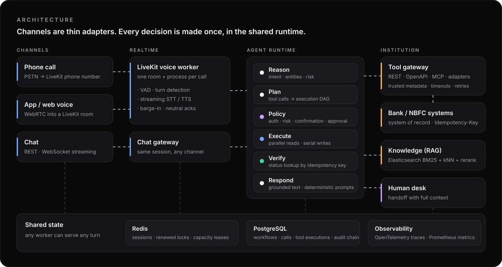
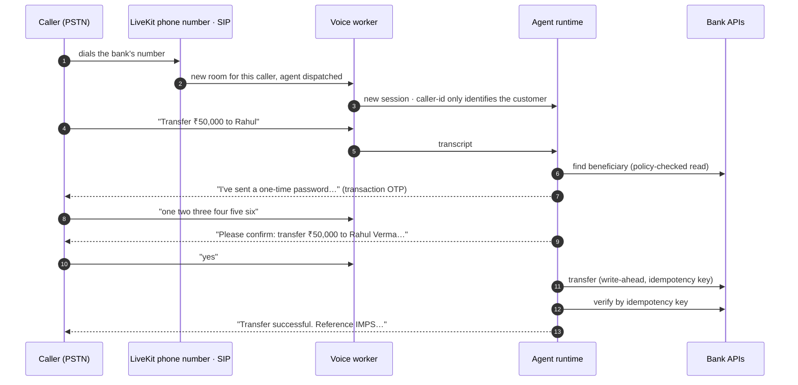

<div align="center">



<br>


**Chat and voice AI agents for banks, NBFCs, insurers and fintechs.**<br>
One agent runtime behind every channel — the institution's APIs are the source of truth,<br>
the policy engine is the authority on what the AI may do, and every money movement is verified.

[Quick start](#-quick-start) · [How it works](#-how-a-request-runs) · [Phone calls](#-phone-calls-with-livekit) · [Security](#-security-model) · [Docs](#-documentation)

</div>

---

## ✦ Why this exists

Putting an LLM in front of a bank is easy. Making it **safe** is the work: the model must never be the thing that
decides whether money moves, a "yes" must confirm exactly what the customer heard, a timeout must never turn into a
duplicate transfer, and a phone call must get the same guarantees as a chat window.

This platform is built around that separation:

| | |
|---|---|
| 🧠 **The model proposes** | intent, entities and tool calls — several at once if it likes |
| 🛡️ **The policy engine authorises** | authentication level, risk, transaction OTP, confirmation, maker-checker — per step, bound to the exact action |
| ⚙️ **The execution engine schedules** | a dependency graph: independent reads in parallel, account changes strictly one at a time |
| ✅ **Verification decides "done"** | the bank's own record, looked up by idempotency key — never "the request was sent" |

## ✦ Highlights

<table>
<tr>
<td width="50%" valign="top">

**🎙️ Voice that behaves like a teller**
- LiveKit phone numbers / SIP and in-app WebRTC
- streaming STT/TTS, multilingual turn detection, barge-in
- neutral spoken acknowledgements during slow work
- "Wait!" after a transfer gets the truth, not a reversal attempt

</td>
<td width="50%" valign="top">

**💸 Money movement you can audit**
- confirmation bound to amount, payee, account, customer, session
- "yes, but make it ₹50,000" never executes — it starts over
- deterministic idempotency keys sent to the bank
- unknown outcomes are verified, then escalated — never resent

</td>
</tr>
<tr>
<td valign="top">

**⚡ Concurrency without races**
- parallel read-only lookups in one wave
- per-session Redis locks (renewed) + versioned saves
- durable workflows survive a worker crash mid-transfer
- cluster-wide limits for calls, LLM, STT, TTS and bank APIs

</td>
<td valign="top">

**🌏 Built for Indian BFSI**
- English + 9 Indian languages, romanised Hinglish
- speech rendering: "₹1,00,000" → "one lakh rupees"
- RAG over approved documents with citations
- PII redaction, hash-chained audit log, human handoff

</td>
</tr>
</table>

## ✦ Architecture



Chat, app voice and phone calls are **thin adapters**. Intent detection, RAG, tool calls, policy, authentication,
handoff and audit are the same code for every channel, so a customer can start in chat, continue on a call and keep
their session, conversation and pending action. The platform never touches the institution's database — customer
data and operations go through REST, OpenAPI, MCP servers or registered adapters.

## ✦ How a request runs



```
Reason ─► Plan ─► Policy ─► Execute (DAG) ─► Verify ─► Respond
```

- **Plan** turns the model's tool calls into a validated graph — duplicates removed, dependencies taken only from
  server-side tool metadata, server-defined workflow templates applied (e.g. *find beneficiary → check → transfer → verify*).
- **Policy** runs for every single step. A tool cannot execute just because the model asked for it.
- **Execute** runs independent reads together; a state-changing step runs alone, is written ahead to the database
  before it is sent, and is shielded from cancellation if the caller interrupts.
- **Verify** checks the bank's record. Success is reported only after it; an ambiguous result gets
  *"I couldn't confirm whether it went through. I have not sent it again…"* and a human follow-up.

## ✦ Phone calls with LiveKit



Every call gets its **own session, conversation and workflows** — never keyed by phone number. A known caller is
only *identified*; balances still need an OTP and transfers still need a transaction OTP and confirmation. Raw phone
numbers are never stored: call records keep a masked number and a keyed hash. Hanging up cancels only what was never
sent; a submitted transfer is awaited and verified, never cancelled.

## ✦ Quick start

> Requires Docker. Everything runs locally against a sandbox **mock bank** — no real accounts, no vendor keys needed for chat.

```bash
git clone https://github.com/sanketwork300-hash/voiceagent_for_bsfi.git
cd voiceagent_for_bsfi/backend
cp .env.example .env

# API, mock bank, Postgres, Redis, Elasticsearch, web app (+ the LiveKit voice worker)
docker compose --profile ui --profile voice up -d --build --wait
```

| Open | |
|---|---|
| **Customer assistant** | http://localhost:3000/assist |
| **Staff console** | http://localhost:3000 — org `demo-bank`, `admin@demo-bank.example`, password `DemoBank!2026secure`, any 6-digit MFA code except `000000` |
| **API docs** | http://localhost:8000/docs |

The sandbox OTP is always `123456`. Try:

- *"What is my balance and my recent transactions?"* — two lookups in one parallel wave
- *"Transfer ₹1,000 to Rahul"* → `123456` → *"yes"* — the full verified money-movement flow
- *"Mera credit card ka outstanding kitna hai?"* — Hinglish, answered in Hinglish
- *"What are home loan foreclosure charges?"* — answered from approved documents with a citation

<details>
<summary><b>Run without Docker</b></summary>

```bash
cd backend
uv venv --python 3.12 && uv pip install -e ".[dev,voice]"
DATABASE_URL=sqlite+aiosqlite:///./dev.db DB_AUTO_CREATE=true AUTO_SEED=true REDIS_URL= KNOWLEDGE_BACKEND=memory \
  uvicorn mock_bank.app:app --port 8100 &  uvicorn app.main:app --port 8000

cd ../frontend && cp .env.example .env.local && npm install && npm run dev   # http://localhost:3000
```

</details>

<details>
<summary><b>Connect a real phone number</b></summary>

1. Rent a number in LiveKit Cloud (or bring a carrier SIP trunk into LiveKit SIP).
2. In `backend/.env` set `LIVEKIT_URL=wss://<project>.livekit.cloud`, `LIVEKIT_API_KEY`, `LIVEKIT_API_SECRET`,
   plus your STT/TTS provider keys (e.g. `SARVAM_API_KEY`).
3. Bind the number to the agent:
   ```bash
   python -m scripts.provision_telephony --list                                   # see your dispatch rules
   python -m scripts.provision_telephony --tenant demo-bank --rule-id SDR_xxx      # adopt a dashboard rule
   ```
4. Start the worker: `docker compose --profile voice up -d --wait voice-agent` and watch
   `docker logs -f backend-voice-agent-1` for `registered worker`.

Details: [backend/docs/voice.md](backend/docs/voice.md).

</details>

<details>
<summary><b>Choose the LLM</b></summary>

| `LLM_PROVIDER` | |
|---|---|
| `rule_based` *(default)* | deterministic offline stand-in — demos, CI and the evaluation suite run with no API key |
| `openai` | any OpenAI-compatible endpoint: OpenAI, Anthropic, Gemini, Groq, Mistral, OpenRouter, LiteLLM… |
| `local` | self-hosted models behind an OpenAI-compatible API: Ollama, vLLM, TGI, llama.cpp |

Set `LLM_BASE_URL`, `LLM_MODEL`, `LLM_API_KEY`; `LLM_FALLBACK_PROVIDER` adds failover. Whatever the model, it only
proposes — authentication, policy, confirmation and verification are unchanged.

</details>

## ✦ Security model

| Threat | What stops it |
|---|---|
| Prompt injection asks for a transfer | money tools are only offered for action intents, and every call still needs auth + OTP + confirmation |
| Model invents a tool or a customer id | the gateway only runs tools offered this turn; `customer_id` always comes from the session |
| "Yes" confirms something else | confirmation, transaction OTP and approval are bound to a hash of the exact action |
| Timeout → duplicate transfer | financial writes are never retried; ambiguous outcomes are looked up by idempotency key |
| Two requests on one session at once | per-session Redis lock across all workers, version-checked saves |
| Worker dies mid-transfer | write-ahead workflow state; the next turn — on any worker — verifies instead of resending |
| Phone number treated as login | caller-id only identifies; high-risk actions require strong factors |
| Secrets in logs or transcripts | OTPs/PINs/CVVs stripped before storage, PII-redacted logs, hash-chained audit |

## ✦ Repository

```
backend/    FastAPI agent runtime · execution engine · tool gateway (REST/OpenAPI/MCP) · policy engine
            · RAG (Elasticsearch) · LiveKit voice worker & telephony · handoff · audit · observability · evaluation
frontend/   Next.js customer assistant (chat + voice) and staff console (traces, policies, approvals, handoff desk)
docs/       README assets
```

## ✦ Testing

```bash
cd backend  && pytest                                   # 186 unit · integration · security · evaluation tests
BFSI_INFRA_TESTS=1 pytest tests/integration/test_real_infrastructure.py   # real Redis/Postgres/ES, 3 workers
cd frontend && npm test && npm run test:e2e             # 50 unit/component · 24 Playwright end-to-end
```

The suites cover parallel reads, financial non-concurrency, "yes but different amount", transfer timeout →
verification without resend, worker-crash recovery, 100 concurrent sessions, 10 concurrent requests on one session,
three simultaneous callers on one phone number, and the evaluation scenarios on both chat and voice.

## ✦ Documentation

| | |
|---|---|
| [Backend overview](backend/README.md) | API, configuration, evaluation, limitations |
| [Architecture](backend/docs/architecture.md) | turn lifecycle, pending actions, RAG, tool gateway, data model |
| [Orchestration](backend/docs/orchestration.md) | execution DAG, concurrency, verification, idempotency, horizontal scaling |
| [Voice & telephony](backend/docs/voice.md) | LiveKit phone numbers, call lifecycle, barge-in, capacity planning |
| [Integrations](backend/docs/integrations.md) | OpenAPI/MCP governance extensions and the idempotency contract |
| [Security](backend/docs/security.md) | threat model and controls |
| [Frontend](frontend/README.md) | customer and staff experiences, BFF, voice state machine |

<div align="center">
<sub>The animated diagrams are plain SVG (no scripts) and respect <code>prefers-reduced-motion</code>.</sub>
</div>
